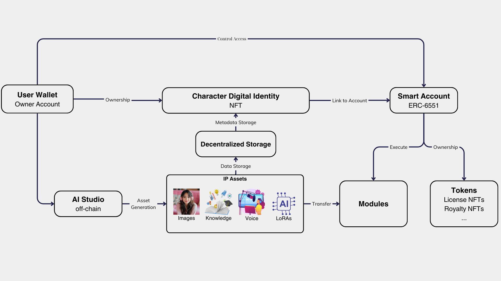

# Naki - IP Launchpad for AI-Generated Characters Assets

## Project Overview

Naki is building a **IP Launchpad for AI-Generated Characters Assets**, Naki wants to empower Creators to collaboratively build and monetize their AI Characters IP. Creators can create an AI Character, mint it as an NFT registered as IP Asset. Other creators can then leverage these IP Assets to create new contents for the AI Characters, sharing revenue with the original IP owner when income is generated.

Over time, popular AI Characters will attract more content contributions, ultimately evolving into crowd-created virtual Influencers that can generate millions in revenue. The platform allows contributors to add value through data, content, and interactions, refining and improving the AI models over time.

## System Architecture

The architecture of the system includes several key components and layers:

1. **User Wallet (Owner Account)**: Represents the user's wallet, allowing ownership and control over the Character NFT and associated IP Assets, as well as interaction for transactions and permissions management.

2. **Character Digital Identity (NFT)**: The Character NFT serves as a unique digital identity on the blockchain, storing metadata and linking with the smart account to manage interactions and asset ownership.

3. **Smart Account (ERC-6551)**: A decentralized entity that manages IP Assets, licenses, and tokens. It executes functions related to asset management, transactions, and governance between the user wallet, character identity, and generated assets.

4. **Decentralized Storage (IPFS)**: A decentralized storage system for metadata and IP Assets, ensuring distributed, secure storage and easy retrieval tied to the Character NFT.

5. **IP Assets (Images, Knowledge, Voices, LoRAs)**: Represents the generated assets linked to the Character NFT, such as images, knowledge repositories, voice data, and LoRA models, which are stored on the decentralized network and can be transferred or licensed.

6. **AI Studio (Off-Chain)**: Generates and processes content such as images, voices, and knowledge, and trains AI models (LoRAs) based on user input, contributing to the system's content creation and enhancement.

7. **Modules**: Provide additional functionalities, allowing character capabilities to expand, including interactions with different platforms or executing transactions as directed by the smart account.

8. **Tokens (License NFTs, Royalty NFTs, etc.)**: Manage tokenized assets like licenses and royalties, representing ownership of IP Assets and enabling monetization, trading, or licensing within the ecosystem.
   

## Key Components & Techniques

| Component | Technique | Description | Link |
| --------- | --------- | ----------- | ---- |
| **AI Model Training** | LLM, Stable Diffusion | Trains AI models to generate content, process voice data, and enhance Virtual Characters based on community input. | [AI Model Training](https://github.com/Naki-Official/llm-fine-tuning) |
| **Content Creation** | Image, Music, Video | AI-generated content is created based on community standards and input, stored, and retrieved from IPFS. | [Content Creation](https://github.com/Naki-Official/content-creation) |
| **Voice and Text Processing** | Voice Cloning, Prompt Templates | AI processes voice data and text interactions to enhance the realism and personalization of Virtual Characters. | [Voice and Text Processing](https://github.com/Naki-Official/voice-cloning) |
| **UI** | React, Next.js | The frontend interfaces and smart contracts managing user interactions, NFTs, and social applications. | [UI](https://github.com/Naki-Official/naki-web-app-ui) |
| **Backend** | FastAPI, MongoDB | The off-chain AI processing, model training, and data management, including integration with IPFS and governance platforms. | [Backend](https://github.com/Naki-Official/naki-web-app-backend) |

**Note:** The links to the repositories above are private. Please contact us at **business@naki.ai** to request access.

## Workflow

1. **Content Submission**: Contributors submit data (e.g., image, music, voice) through the UI.
2. **Data Processing**: The AI Studio processes the data, enhancing the Virtual Characters' personalities and content generation capabilities.
3. **Proposal Creation**: Community members create proposals through the Governance Platform (Naki DAO) to train or refine AI models.
4. **Model Training**: Proposals that are accepted lead to the training of AI models using community-contributed data.
5. **Content Creation**: The trained models generate new content, which is uploaded to IPFS and made available to users.
6. **User Interaction**: Users interact with Virtual Characters via the DApp/SocialApp, and their interactions are used to further refine the models.

## Contributing

Naki is built collectively by the community. Contributions can be made by providing data, participating in governance, or developing new features. All contributions are rewarded through the Revenue Factory Smart Contract.
